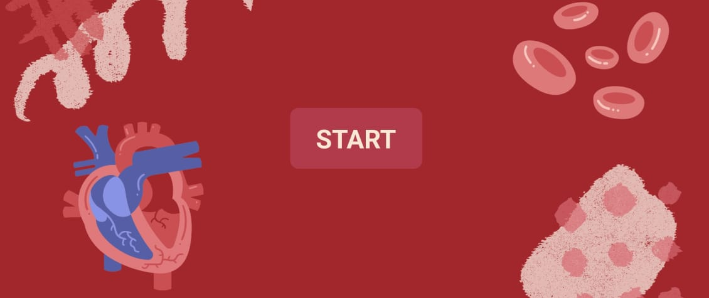
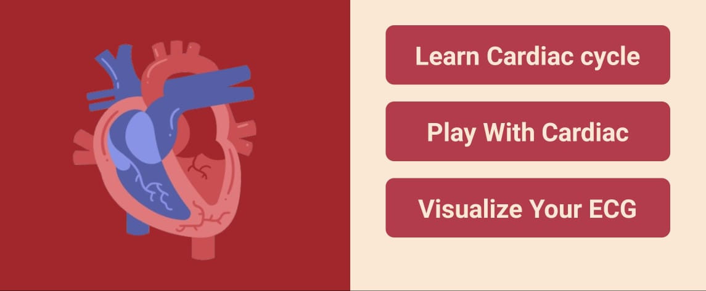
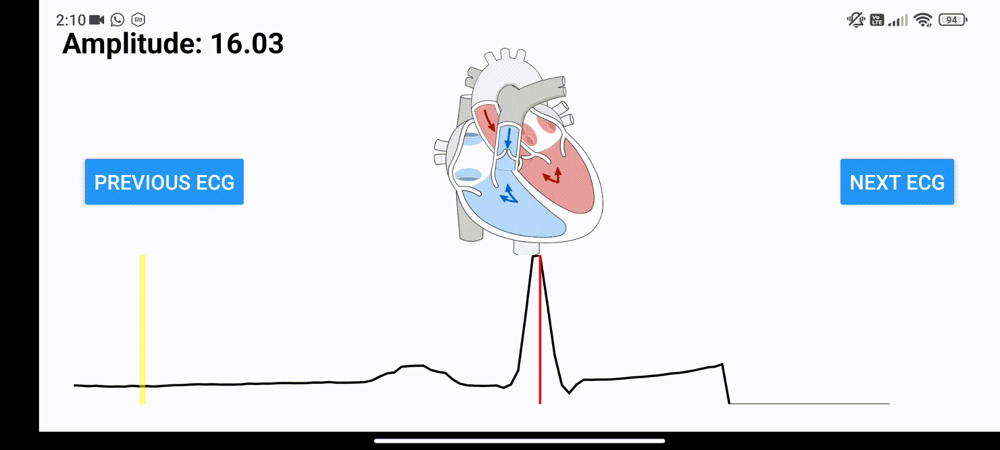
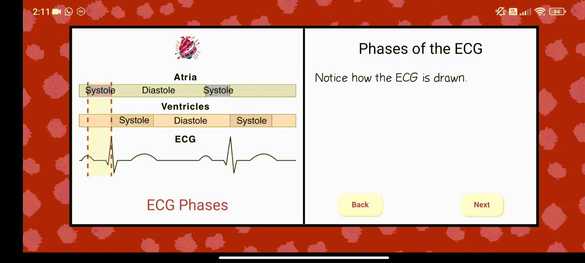
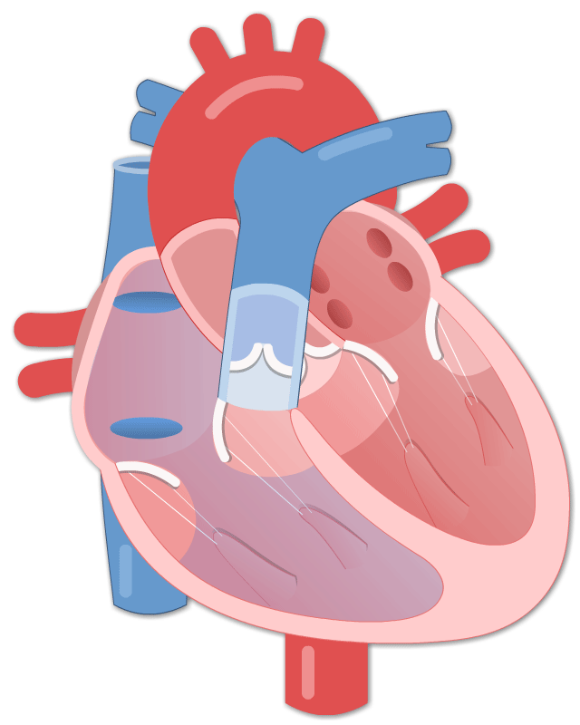
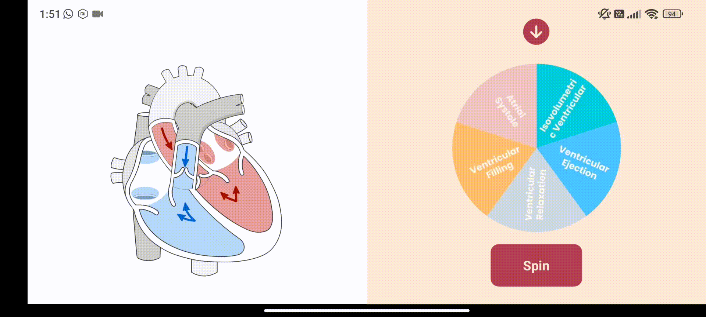

    
  <h1>Beats and Flow</h1>
  

---

## Overview

This application is designed as an interactive educational tool to help users understand the physiological relationship between the electrocardiogram (ECG) and heart activity. It simulates the cardiac cycle phases and their correlation with ECG patterns, providing a visually engaging experience for students, educators, and healthcare trainees.

- [Download the App](https://drive.google.com/file/d/1YWdF7Sg8_z1YSCmvSieP9UeU3xn5ix9b/view?usp=sharing)
- [Watch Video Demo](https://youtu.be/IHud7nQ8U0A?si=-sNqB_jfBzN0eTAo)

> **Note:** This project was developed as part of the Anatomy Course (SBES 2120) at Cairo University's Faculty of Engineering.

---

## App Story

  
  

✨ It was a Tuesday at 12 PM when our anatomy lecture began, led by the incredible professor who always inspired us to think creatively and transform theoretical science into practical, impactful projects. I consider myself fortunate to learn anatomy under such a visionary teacher.

📚 That day, the professor delved into the cardiac cycle, explaining how ECG patterns relate to the cycle, action potentials, and their influence on the ECG output. It was fascinating to see the intricate relationship between physiology and technology unfold before our eyes.

💡 As someone driven by my personal motto, _"A lover of making human life easier,"_ I felt inspired to create something meaningful. This inspiration gave birth to the idea of developing an engaging and interactive tool to help future doctors and nurses master this complex topic in a way that is both educational and enjoyable.

---

  
  

## Why Beats and Flow?

- **Interactive Learning**: Makes understanding ECG and cardiac activity enjoyable and memorable.
- **Comprehensive Visualization**: Provides detailed animations that simplify the learning process.
- **Accessibility**: Designed for all learners, from students to professionals.
- **Future-Oriented**: Prepares users for advanced studies and applications in cardiology.

---

## Features

- **ECG Input**: Accepts ECG waveforms as input, allowing users to explore the correlation between ECG patterns and heart activity.

  

    
  

  

    
  

- **Visualization Tools**: Animates heartbeats based on ECG input to illustrate the cardiac cycle phases dynamically.

  

    
  

- **Interactive Game**: A game designed to help users understand the phases of the cardiac cycle through fun and engaging activities.
  

    
  

- **Educational Value**: Provides a focused understanding of heart rhythms, cardiac functions, and their visual representation through ECG.

---

## Methodology

The app is built using **React Native**, ensuring compatibility across various devices.

---

## References

Special thanks to Prof. Aliaa Rehan for guidance and content.

---

## Sources

- [Human Bio Media - Cardiac Cycle Animations](https://www.humanbiomedia.org/cardiac-cycle-animations/)
